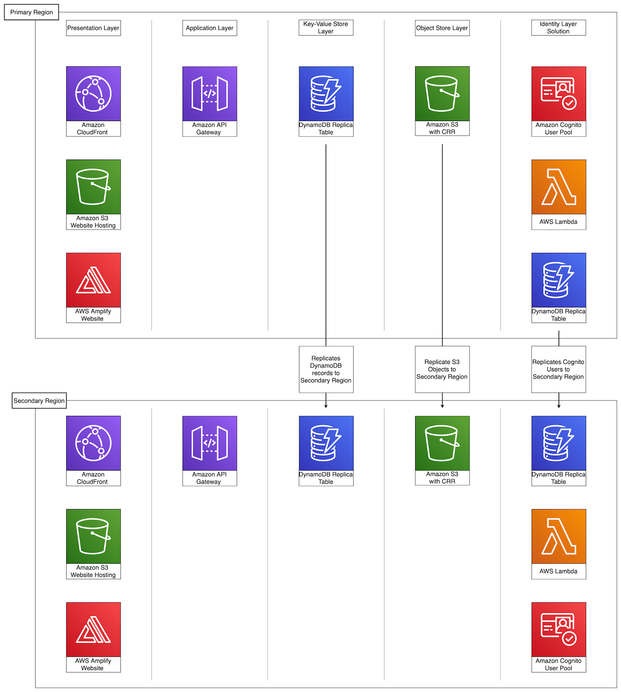

# Multi Region Application Architecture

The Multi Region Application Architecture Solution deploys an N-Tier application into two AWS regions. The region in which you deploy the CloudFormation Stack is known as the Primary region. The Secondary region is specified as a parameter to the CloudFormation Template. A Sample photo sharing application is included in the solution to exercise the underlying multi-region layers. It leverages Cognito User Pools for User Authentication and Authorization, S3 for Photo Storage, and DynamoDB for Photo Comments Storage.

## On this Page
- [Architecture Overview](#architecture-overview)
- [Layers Overview](#layers-overview)
- [Creating a custom build](#creating-a-custom-build)
- [License](#license)

## Architecture Overview


## Layers Overview
The N-Tier application is composed of many underlying layers, each of which is its own CloudFormation template. 
* The **Presentation Layer** deploys a sample Photo Sharing website independently to both regions. The website is built using React and Amplify, is hosted in a S3 bucket configured for static website hosting, and distributed via CloudFront.
* The **Routing Layer** deploys an API in both regions used by the Presentation Layer to retrieve the current state of the application (active/fenced/failover). This allows the Presentation Layer to configure itself to target back-end resources in either the primary or secondary region. The API is built with Amazon API Gateway and uses a DynamoDB Proxy Integration to retrieve the application state.
* The **Application Layer** deploys a sample Photo Sharing backend-API independently to both regions. The backend is built using Amazon API Gateway, with DynamoDB Proxy Integration to store and retrieve comments made on photos.
* The **Key-Value Store Layer** uses a CloudFormation Custom Resource to deploy a DynamoDB Global Table in both regions. This Global Table stores the comments made on photos.
* The **Object Store Layer** uses a CloudFormation Custom Resource to deploy S3 buckets in primary and secondary regions, and set up Cross-Region Replication between them. These buckets store the photos uploaded by users.
* The **Identity Layer** uses deploys a Cognito User Pool in each region. When a new user completes initial sign-up in the Primary region, a Cognito Lambda Trigger is invoked which adds the user details to a DynamoDB Global Table. In the Secondary region, a CloudWatch Events Rule triggers a Lambda function every 5 minutes that checks the Global Table for users that have not yet been imported and starts a Cognito User Import Job to add them to the seconday user pool.

## Creating a custom build
The solution can be deployed through the CloudFormation template available on the solution home page.
To make changes to the solution, download or clone this repo, update the source code and then run the deployment/build-s3-dist.sh script to deploy the updated Lambda code to an Amazon S3 bucket in your account.

### Prerequisites:
* [AWS Command Line Interface](https://aws.amazon.com/cli/)
* Node.js 10.x or later

### 1. Create an Amazon S3 Bucket
The CloudFormation template is configured to pull the Lambda deployment packages from Amazon S3 bucket in the region the template is being launched in. Create a bucket in the desired region with the region name appended to the name of the bucket. eg: for us-east-1 create a bucket named: `my-bucket-us-east-1`
```
aws s3 mb s3://my-bucket-us-east-1
```

### 2. Create the deployment packages
Build the distributable:
```
chmod +x ./build-s3-dist.sh
./build-s3-dist.sh my-bucket multi-region-application-architecture my-version
```

> **Notes**: The _build-s3-dist_ script expects the bucket name as one of its parameters, and this value should not include the region suffix

Deploy the distributable to the Amazon S3 bucket in your account:
```
aws s3 sync ./regional-s3-assets/ s3://my-bucket-us-east-1/multi-region-application-architecture/my-version/ 
aws s3 sync ./global-s3-assets/ s3://my-bucket-us-east-1/multi-region-application-architecture/my-version/ 
```

### 3. Launch the CloudFormation template.
* Get the link of the multi-region-application-architecture.template uploaded to your Amazon S3 bucket.
* Deploy the Multi Region Application Architecture Solution to your account by launching a new AWS CloudFormation stack using the S3 link of the multi-region-application-architecture.template.

## License

* This project is licensed under the terms of the Apache 2.0 license. See `LICENSE`.
