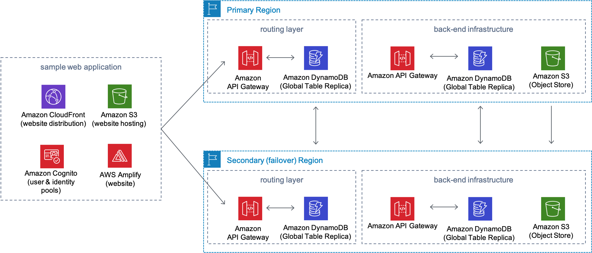

# Multi Region Application Architecture

Many Amazon Web Services (AWS) customers have business requirements that require expedient recovery from regional failure with little-to-no application data loss. To help demonstrate an active/passive serverless architecture with easy failover to a backup region, AWS offers Multi-Region Application Architecture. 

This reference architecture leverages Amazon Simple Storage Service (Amazon S3) Cross-Region replication and Amazon DynamoDB Global Tables to asynchronously replicate application data between the primary and secondary AWS Regions. A sample photo-sharing web application is also included and can be deployed after the solution has finished its deployment. The web application will serve as a visual demonstration of the solution’s back-end layers and to verify that regional failover is working.

## On this Page
- [Architecture Overview](#architecture-overview)
- [Creating a custom build](#creating-a-custom-build)
- [License](#license)

## Architecture Overview


The AWS CloudFormation template uses CloudFormation StackSets to deploy the routing layer and back-end infrastructure in both the primary and secondary (failover) AWS Regions. An optional second CloudFormation template can be deployed after the solution’s main template has finished its deployment. The second template will deploy an AWS Amplify sample web application hosted in an Amazon Simple Storage Service (Amazon S3) bucket, an Amazon CloudFront distribution to deliver the web application to users, and Amazon Cognito user and identity pools to enable users to sign in to the web application and access the routing layer & back-end infrastructure resources.

When the web application is loaded, it queries the solution’s routing layer for the current state of the application (active, fenced, failover), and configures AWS Amplify to target the solution’s resources in the correct Region. The state of the application is also retrieved when the user uploads a new photo or adds a comment. Depending on the state of the application, a message may be displayed to the user indicating certain actions are unavailable or prompt them to refresh the application. For more information, see Application States.

For more information, please see the solution's [implementation guide](https://docs.aws.amazon.com/solutions/latest/multi-region-application-architecture/).

## Creating a custom build
The solution can be deployed through the CloudFormation template available on the solution home page.
To make changes to the solution, download or clone this repo, update the source code and then run the deployment/build-s3-dist.sh script to deploy the updated Lambda code to an Amazon S3 bucket in your account.

### Prerequisites:
* [AWS Command Line Interface](https://aws.amazon.com/cli/)
* Node.js 10.x or later

### 1. Create an Amazon S3 Bucket
The CloudFormation templates are configured to pull the Lambda deployment packages from Amazon S3 buckets in the regions the templates are being launched in. The region in which you deploy the template will be referred to as the primary region. When deploying, you will supply the secondary region (which will serve as the disaster recovery region) as a CloudFormation stack parameter.

Create buckets in the desired regions with the region name appended to a common prefix (eg: `my-bucket`). For `us-east-1` as the primary region and `ap-northeast-1` as the secondary, create buckets named: `my-bucket-us-east-1` and `my-bucket-ap-northeast-1`.
```
aws s3 mb s3://my-bucket-us-east-1 --region us-east-1
aws s3 mb s3://my-bucket-ap-northeast-1 --region ap-northeast-1
```

### 2. Create the deployment packages
Build the distributable:
```
chmod +x ./build-s3-dist.sh
./build-s3-dist.sh my-bucket multi-region-application-architecture my-version
```

> **Notes**: The `build-s3-dist` script expects the bucket prefix as one of its parameters, and this value should _not_ include a region suffix

Deploy the distributable to the Amazon S3 bucket in your account:
```
aws s3 sync ./regional-s3-assets/ s3://my-bucket-us-east-1/multi-region-application-architecture/my-version/ 
aws s3 sync ./global-s3-assets/ s3://my-bucket-us-east-1/multi-region-application-architecture/my-version/ 
aws s3 sync ./regional-s3-assets/ s3://my-bucket-ap-northeast-1/multi-region-application-architecture/my-version/ 
aws s3 sync ./global-s3-assets/ s3://my-bucket-ap-northeast-1/multi-region-application-architecture/my-version/ 
```

### 3. Launch the CloudFormation template.
* Get the link of the `multi-region-application-architecture.template` uploaded to your Amazon S3 bucket in the _primary region_.
* Deploy the Multi Region Application Architecture Solution to your account by launching a new AWS CloudFormation stack using the S3 link of the `multi-region-application-architecture.template` in the _primary region_.

## Collection of operational metrics
This solution collects anonymous operational metrics to help AWS improve the quality and features of the solution. For more information, including how to disable this capability, please see the [implementation guide](https://docs.aws.amazon.com/solutions/latest/multi-region-application-architecture/appendix-d.html).

## License

* This project is licensed under the terms of the Apache 2.0 license. See `LICENSE`.
